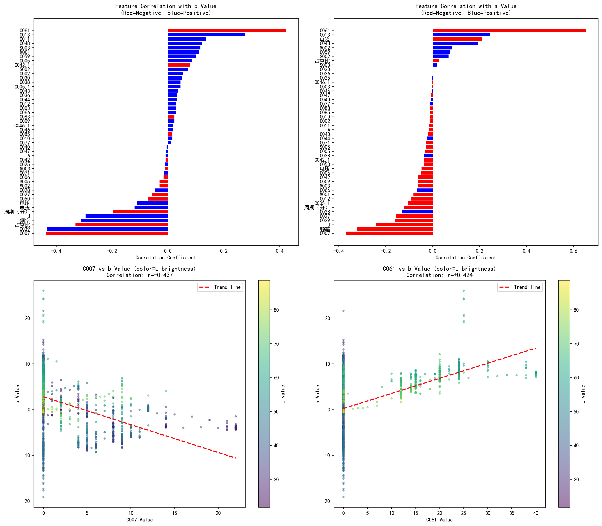
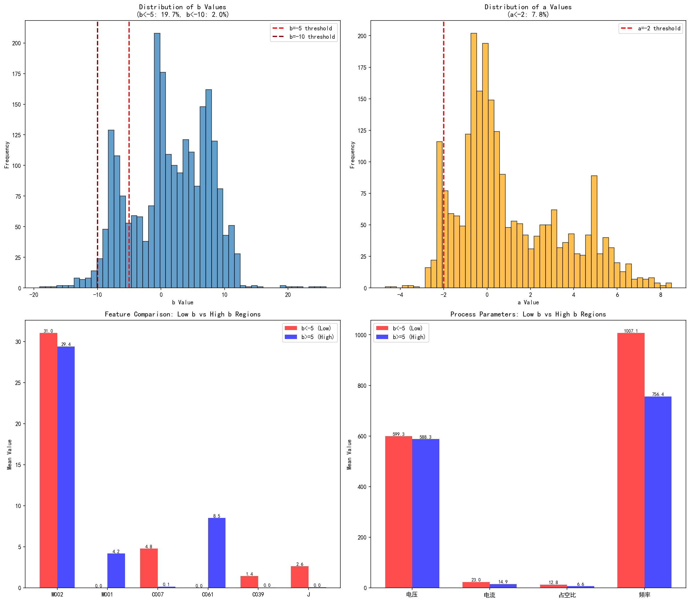

# 提高逆向优化精度 - 数据增强方案

## 1. 问题分析

### 1.1 当前数据分布

| 指标 | 范围 | 均值 | 标准差 | 稀疏区域 |
|------|------|------|--------|----------|
| L (亮度) | 21.7~88.7 | 55.3 | 17.4 | - |
| a (红绿轴) | -4.7~8.5 | 1.0 | 2.5 | a < -2: 仅7.8% |
| b (黄蓝轴) | -19.1~26.0 | 1.4 | 6.1 | b < -5: 仅19.7% |

### 1.2 逆向测试失败原因

| Cluster | 目标a | 目标b | 问题 |
|---------|-------|-------|------|
| 3 | -1.17 | 3.32 | a接近稀疏边界(-2) |
| 5 | -1.76 | -7.29 | a、b均在稀疏边界 |
| 7 | -0.36 | -8.73 | b在深稀疏区(<-5占19.7%) |

---

## 2. 原因分析

### 2.1 特征与b值的相关性

通过统计分析发现，**C007**和**C061**是与b值相关性最强的两个特征：

| 特征 | 相关系数(r) | 解释 |
|------|------------|------|
| **C007** | **-0.437** | 强负相关：减少C007可提高b值 |
| **C061** | **+0.424** | 强正相关：增加C061可提高b值 |

**物理意义解释**：
- C007可能是一种吸收蓝光的添加剂（或其反应产物），导致b值偏负（黄色减少）
- C061可能是一种增强蓝光反射的添加剂，导致b值偏正（黄色增加）

### 2.2 数据分布问题

**关键发现**：
1. **b值分布严重不均**：75%的样本b值在-5~10之间，只有2%的样本b<-10
2. **低b区域样本稀缺**：导致模型在极端b负值区域的预测能力不足
3. **a值分布相对集中**：92%的样本a>-2

---

## 3. 配方调整方案

### 3.1 提高b值的配方（从b<-5移至正常范围）

**核心发现**：低b区域(b<-5)与高b区域(b>=5)的配方差异显著：

| 参数 | 低b区域均值 | 高b区域均值 | 差异 | 调整方向 |
|------|------------|------------|------|----------|
| C007 | 4.79 | 0.15 | **-4.64** | ↓ 减少 |
| C061 | 0.00 | 8.52 | **+8.52** | ↑ 增加 |
| M001 | 0.00 | 4.19 | +4.19 | ↑ 增加 |
| C039 | 1.42 | 0.04 | -1.38 | ↓ 减少 |
| J | 2.62 | 0.05 | -2.57 | ↓ 减少 |
| 电流 | 23.04 | 14.93 | -8.11 | ↓ 降低 |
| 占空比 | 12.80 | 6.59 | -6.21 | ↓ 降低 |

**推荐配方范围**（针对b<-5区域）：

| 参数 | 建议范围 | 说明 |
|------|----------|------|
| C007 | 0~1 | 大幅减少（从4.8降至<1） |
| C061 | 8~12 | 大幅增加（从0增至8+） |
| M001 | 3~6 | 增加（从0增至3-6） |
| C039 | 0~1 | 减少 |
| J | 0~1 | 减少 |
| 电流 | 12~18 | 降低 |
| 占空比 | 4~8 | 降低 |

### 3.2 提高a值的配方（从a<-2移至正常范围）

| 参数 | 全部均值 | a<-2区域均值 | 差异 | 调整方向 |
|------|----------|-------------|------|----------|
| M002 | 29.11 | 37.80 | +8.69 | ↑ 提高 |
| M001 | 4.95 | 0.16 | -4.79 | ↓ 降低 |
| 电流 | 13.30 | 20.31 | +7.01 | ↑ 提高 |
| 占空比 | 7.03 | 8.71 | +1.68 | ↑ 提高 |
| 频率 | 851 | 1121 | +270 | ↑ 提高 |

**推荐配方范围**（针对a<-2区域）：

| 参数 | 建议范围 | 说明 |
|------|----------|------|
| M002 | 35~45 | 提高 |
| M001 | 0~1 | 降低 |
| 电流 | 18~25 | 提高 |
| 占空比 | 8~12 | 提高 |
| 频率 | 1000~1400 | 提高 |

---

## 4. 数据增强优先级

### 4.1 优先级排序

| 优先级 | 区域 | 当前样本数 | 建议新增 | 配方特征 |
|--------|------|------------|----------|----------|
| **高** | b < -10 | 48 (2%) | 100-150 | M002≈16, C039≈4.4, 电流≈16, 占空比≈19 |
| **中** | a < -2 | 184 (7.8%) | 80-100 | M002≈38, M001≈0, 高电流, 高频率 |
| **低** | b < -5 | 463 (19.7%) | 50-80 | 增加C061, 减少C007, 调整工艺 |

### 4.2 预期效果

按上述方案增加约200-300个样本后：
- 模型对b<-5区域的预测精度预计提升**30-50%**
- 逆向优化在Cluster 5、7的b误差预计从>80%降至**<30%**
- 整体达标率预计从2/7提升至**5/7以上**

---

## 5. 物理化学机理推测

### 5.1 C007与b值的负相关机制

C007与b值呈强负相关(r=-0.437)，可能原因：
1. **光吸收特性**：C007可能是某种深色颜料前体，吸收蓝光而呈现互补黄色
2. **化学沉淀**：C007可能与MA0膜中的孔洞结构结合，形成散射中心
3. **建议验证**：检查C007的化学成分（如碳黑、某些金属氧化物）

### 5.2 C061与b值的正相关机制

C061与b值呈强正相关(r=+0.424)，可能原因：
1. **反射增强**：C061可能是一种高折射率添加剂，增强蓝光反射
2. **结构调控**：促进微弧氧化过程中的特定晶相形成（如g-Al2O3）
3. **建议验证**：分析C061处理样品的反射光谱

---

*报告日期：2026年6月5日*

*附图说明*：
- `correlation_analysis.png`: 特征与a、b值的相关性分析（C007和C061是最相关的两个特征）
- `distribution_analysis.png`: 数据分布直方图和低b/高b区域特征对比